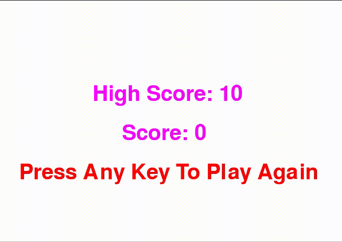

# One-Button Circle Game

This project is a highscore based game, where the goal is to click on the Space Button when the ball overlaps with the line extending from the center. The ball speed increases and switches direction each time a succesful button press occurs. If the space button is pressed before the ball crosses or the ball crosses the line without a button press, the game is over.

My high score is 17, what is yours?
